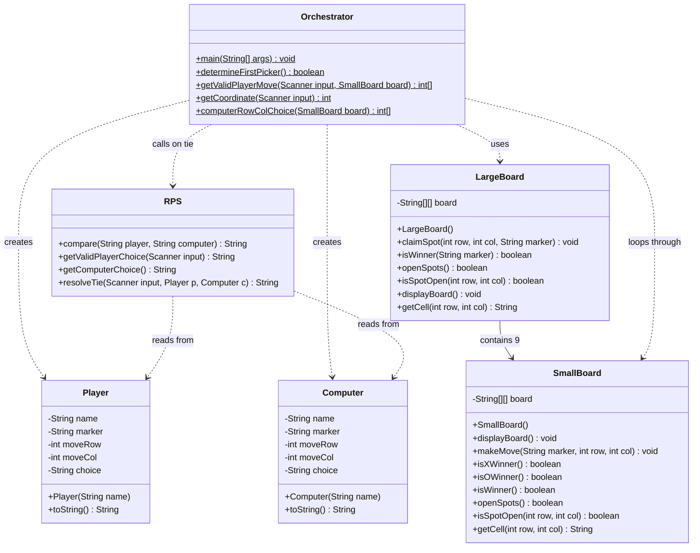

# Tic-Tac-Go
A Java implementation of a modified **Ultimate Tic-Tac-Toe** game where nine 3×3 tic-tac-toe boards are arranged in a 3×3 grid. Win small boards to claim spots on the large board. Win three in a row on the large board to win the match.

**Opponents:** Human player vs. Computer (random-move AI)  
**Tiebreaker:** When either board ends in a draw, rock-paper-scissors decides who claims that spot.

---

## How to Compile

```bash
javac *.java
```

## How to Run

```bash
java Orchestrator
```

---

## Gameplay

1. Enter your name and choose a marker: **X** or **O**
2. The computer is assigned the opposite marker
3. One player is randomly chosen to go first
4. **Each turn:**
   - A player selects an unclaimed spot on the **large board** (3×3)
   - This sends them to that spot's **small board** (also 3×3) to play a round of tic-tac-toe
   - Players alternate moves on the small board until someone wins or it fills
5. **Winning a small board:** First player to get three in a row claims that spot on the large board
6. **Tie on a small board:** If the small board fills with no winner, a **rock-paper-scissors match** breaks the tie
   - Players choose rock, paper, or scissors
   - On a tie, they replay RPS
   - Winner claims the spot on the large board
7. **Winning the match:** First player to win three in a row on the large board wins the entire match

---

## System Diagram



Player and Computer each have a getter and setter for every field.
